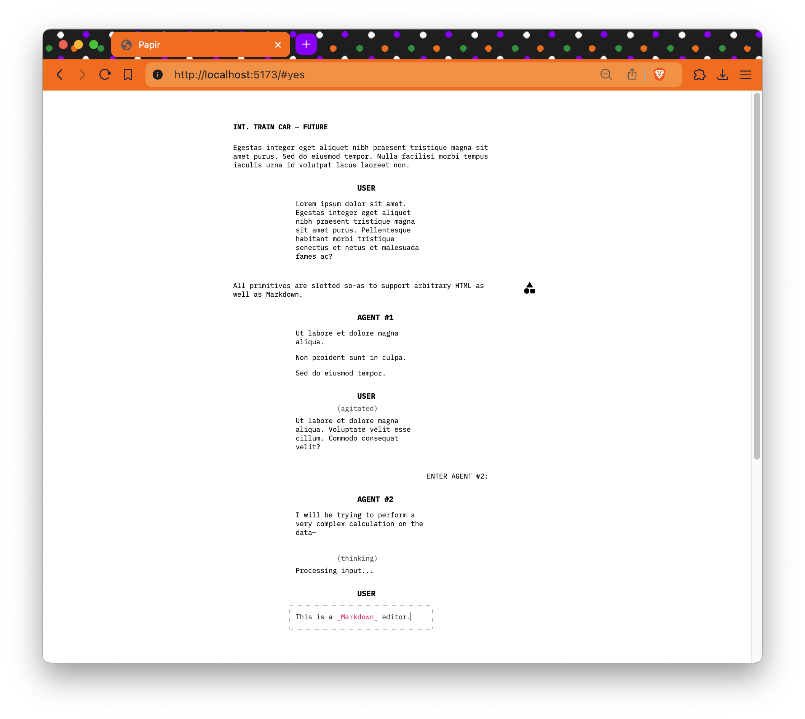

# Papir
Playwriting as general-purpose UI/UX for multi-agent AI environments, contrary to chat interfaces.

Papir is a Svelte implementation of a dramaturgy-inspired design system that reimagines chat interfaces as plays (standard screenplay formatting, in particular.) Rather than extending chat interfaces with new primitives, such as [artifacts][1], Papir taps into into the inherent expressiveness of dramatic writing, and hundreds of years of literary tradition. We believe this is a promising avenue for human-machine interaction, and will explore it more in the future.



## Example
Please note the example is only illustrative, and the library have not been properly packaged yet.

```svelte
<script lang="ts">
	import { Papir, Dialogue, Scene, Action, Transition, Buffer } from "papir";
	import { typewriter } from "papir/transition";
	import { loremIpsum, demo } from "./mock";
	let messages = demo();
	let listening = true;
	let prompt = "";
</script>
<Papir>
	<div in:typewriter={{ speed: 50 }}>
		<Scene prefix={"int."} where={"train car"} when={"future"} />
	</div>
	<Action value={loremIpsum().slice(0, -1) + "."} />
	{#each $messages as m, i}
		{#if m.metadata['action']}
			{@const a = m.metadata.action}
			<Action>
				<Buffer markdown={a.content} />
				<!-- page margin contain artifacts, & is how users interact with the environment -->
				<aside slot="right">
					{#each a.artifacts as artifact}
						<!-- render artifacts -->
					{/each}
				</aside>
			</Action>
		{/if}
		{#if m.content}
			<Dialogue
				role={m.role}
				parenthetical={m.metadata.paranthetical}
				markdown={m.content} />
		{/if}
		{#if m.transition}
			{@const t = m.transition}
			<Transition>
				<p in:typewriter={{ speed: 50 }}>{t.text}</p>
				<aside slot="right">
					<!-- yes or no -->
				</aside>
			</Transition>
		{/if}
	{/each}
	{#if listening}
		<Dialogue prompt role={"user"} bind:markdown={prompt} />
	{/if}
</Papir>
```

The `Buffer` component is built from the beautiful [Carta][3]—a Markdown editor, and [Shiki][4] for syntax highlighting.  Also: note that the `Action` and `Dialogue` components are both using `Buffer` under the hood, and like most other things in papir, they may be customised using slots. I know Svelte is moving away from slots and some other things, however I'm not sure I agree with the new direction, & I would hate to break Svelte 4 compatibility regardless.

## Dramaturgy
Much can be said about the unreasonable efficiency of dramatic writing as a UI/UX paradigm.

In the recent years, many chat interfaces have been created to accommodate LLM's, RAG, and various agentic architectures. I believe they may have rushed to implement primitives that are not really good, and fundamentally limiting. Do we really need to be stuck in chat threads circa 2000's? A play is able to order events, speech and actions, and each primitive reads the same regardless of subject: not just for the actors that would take active part by being in the room, but also for the reader that would passively observe the unfolding events.

A bunch of backends would make progressive summarisations of the chat history, and even more sophisticated queries like keeping a completely separate history of the chat for each participant, and so on. The _canonical_ chat history is completely separate from the chat history as it's seen by its participants, and it's been so for quite some time now.

> Observation: chats are basically rooms, where people (and perhaps, agents) speak in turns.

> Observation: in most "AI" chat interfaces, I still don't get to invite my friends to join!

> Observation: traditional chats have few primitives, and they're really complicated, notoriously difficult to make well. A _play_ is different as it has to offer many primitives that are fundamentally very simple and easy to read. We can benefit from decades of literary experience.

Each primitive in the textual representation of a play answers basic questions:

WHERE? and WHEN?—clearly indicated by scene headings, i.e. rooms, spaces, and times:

**INT. BOILER ROOM**

**EXT. THE ESPLANADE — NIGHT**

WHAT? and ABOUT WHAT?—in action statements.

WHO? (HOW?) and WHAT?—dialogue.

```
        DOG PATRON
    (returned)
Woof! Woof! Woof! Grrrrrr, grrrrrr!

        OWNER
I understand everything, my good boy. We'll find you
some European bitches!

MOVING ON:
```

### Margins
Consider that where there's a page of text, there's margins. The biggest step forward in UX of AI systems, chat-bots, agents— the whole lot—in my opinion, was made by Anthropic in the form of [artifacts][1]. An artifact widget is alien to chat, but it doesn't have to be! In a play, there's ways to represent interdiscoursivity using interactive margins. Marks can be placed there strategically to affect how the text, and indeed, the conversations in it, are read: you can see different versions of events, or branches, meaning  time travel.

This is contrary to how alternates have been so far implemented.

We can constantly re-write the action points and introduce transitions whenever new characters are introduced, the external world is concerned, or the context changes significantly. If Agent A in your chat wishes to bring Agent B to complete a certain task, the environment itself can fetch statistics on how long does B usually take to complete similar tasks, how much it costs, & present this information in the margin.

The user would be able to OK it, and the chat history would be updated accordingly.

This is a very simple example of how the chat history can be compressed and decompressed, and how the environment can influence the flow of the conversation. The more sophisticated backends can offer more sophisticated queries, such as keeping a completely separate history of the chat for each participant, and so on.

### Roadmap
This repo is our second attempt at this idea, and we're still rewriting our internal tools to use it.

We'll soon be creating a NPM package, adding some helpful stores for handling typical OpenAI-like chat histories, exposing some rudimentary apis for controlling the buffers. There's talk about establishing some design language for margin-marks, some kind of artifact library for most common use-cases, and perhaps introducing animated components for interacting with it. If you know a thing or two about [Web Components][5] and have ideas how we could package them up, we could use all the help we can get!

## Credits
Brought to you by [Busthorne][2], Ukraine's vanguard language-games lab: we do computational discourse analysis, study intelligent forms, simulations. We've been doing lots of research in computational literature recently, where characters live inside a computer, and the readers are invited to play their parts in some kind of play. In the course of this research, it became clear to us that chat interfaces per se are not the best way to interact with agents, and we believe to have figured out a much more interesting way.

License: MIT

[1]: https://www.youtube.com/watch?v=vUdNaAAc4FY
[2]: https://github.com/busthorne
[3]: https://github.com/BearToCode/carta
[4]: https://shiki.style/
[5]: https://developer.mozilla.org/en-US/docs/Web/API/Web_components
